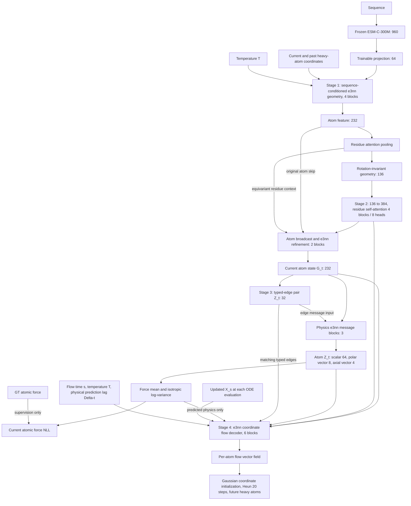

# Heavy-flow v2: Stage 1–4 구현과 실행

현재 구현 기준은 `heavy_flow_v2_geometry_context_pair_messages`이다. 이 문서는
기존 Stage 1–4 보고서의 아키텍처 설명을 대체한다. 이전 보고서의 학습 결과는
이전 구조의 결과이며, v2가 학습 완료되었다는 근거로 사용할 수 없다.

## 데이터와 모델 경로



232 = `96x0e + 24x1o + 8x1e + 8x2e`; invariant width 136 = 96 + 24 + 8 + 8.
Stage 2의 `ResidueGlobalContext.forward`는 pooling 결과와 chain-break/mask 정보를
받으며, ESM tensor나 전체 condition을 받지 않는다. Stage 1을 거친 sequence
정보는 geometry에 포함된다. Context에는 invariant distance/contact 및 residue
index/chain-break pair bias가 남아 있다. Valid residue extent로 거리 bias를
정규화하여 다른 길이의 단백질과 padding해도 해당 단백질의 결과가 바뀌지 않는다.

`pair latent`는 각 directed typed edge의 학습된 32차원 invariant 표현이다.
Pair force target이 아니며, 별도의 GT pair force나 energy supervision은 없다.
기존의 출력 전용 pair projection을 force message 입력으로 연결했다. 기존 axial
projection도 parity-even norm을 atom scalar에 반영해 force variance loss가 학습시킨다.
따라서 force loss는 pair projection, atom scalar/vector/axial projection, context,
geometry, ESM projection으로 역전파된다. ESM-C 본체는 고정된다.

Stage 4는 매번 `X_s`로 거리와 spherical harmonics를 재계산한다. Atom Z는 동일 atom
mapping에, pair Z는 `(source atom, destination atom, edge kind, bond type)`에 연결한다.
현재의 physics edge와 생성 좌표의 동적 edge를 합쳐, 기존 physics edge가 cutoff 밖으로
이동해도 대응을 유지한다. 새 spatial edge는 pair 값 0과 availability 0을 받는다.
Pair를 포함한 edge scalar가 e3nn tensor-product message를 조절한다. 기존 atom
scalar/polar/axial 연산, residue context, predicted force/log-variance 입력은 유지했다.
Force를 velocity나 좌표 증분으로 대체하지 않는다.

## History와 시간 정의

모든 Stage config에 다음 정의를 저장한다.

```yaml
history:
  length: 3                 # 현재 포함: [t-2, t-1, t]
  stride_frames: 1          # 저장된 raw frame 간격
  missing_policy: repeat_earliest
```

`repeat_earliest`는 음수 frame을 0으로 대체한다. 예를 들어 t=0은 `[0,0,0]`,
t=1은 `[0,0,1]`이다. `drop`으로 설정하면 history가 부족한 현재 sample을 제외한다.
Coordinate quarantine에 걸린 history/current/future frame은 sample을 제외하며,
다른 trajectory의 frame으로 채우지 않는다. History는 동일 domain, temperature,
replica의 raw frame에서 읽고, heavy-atom 이름·원소·residue mapping을 확인한다.
미래 frame은 Stage 4 RF target에만 사용한다.

History 상대좌표의 invariant norm과 polar vector 경로는 기존 encoder를 재사용했다.
공통 회전·이동 및 reflection에 대해 기존 irrep/parity 규칙을 따른다. Stage 1–3은
`condition.lag`를 읽지 않는다. 동일 현재/history 입력에서 예측 간격만 바꾸면
eval 모드의 G_t와 Z_t는 bitwise 동일하다. 학습 시 독립 dropout draw에 따른 차이는
이 조건 독립성과 별개다.

Stage 4의 `data.future_lag_frames: 1`은 raw frame 하나 뒤를 target으로 선택한다.
이 mdCATH 데이터의 저장 간격은 **1000 ps/frame**이므로 1은 1 ns 예측이다.
Decoder의 `lag` 값 단위는 frame이고 provenance에 `time_per_frame`을 ps로 저장한다.
이는 history stride와 별도이며, 무차원 생성 시간 `s ∈ [0,1]`과도 다르다.
`frames_per_trajectory`는 현재 frame의 샘플링 개수이고 history stride가 아니다.

## 학습 및 checkpoint 계약

1. Stage 3: 기존 scalar force normalizer로 current atomic force NLL을 학습한다.
   ESM-C 본체를 제외한 projection, Stage 1–3, pair/force 경로를 학습한다.
2. Stage 4: v2 Stage 3 checkpoint의 전체 upstream을 strict-load한 다음, projection을
   포함해 전부 `requires_grad=False` 및 eval로 고정한다. Decoder만 optimizer에 넣는다.
   학습과 추론 모두 `encode_condition(condition)`에서 예측한 physics를 사용한다.

Checkpoint는 architecture version, canonical config, history 정의, upstream 가중치,
force normalizer 및 그 정의/단위, optimizer step 상태와 기존 ESM/split/audit provenance를
보존한다. 재사용한 normalizer는 원본 JSON 전체와 SHA-256을 provenance에 남긴다.
Stage 4 checkpoint에도 upstream 전체 및 그 원래 config/provenance가 들어간다.

구형 checkpoint는 `--resume`, `--initialize-from`, Stage 4 handoff에서 거부한다.
선택적으로 Stage 3에 `--warm-start OLD_STAGE3.pt`를 주면 이름·shape가 맞는 가중치만
초기화에 사용한다. `<output>.warm_start.json`에 `loaded`, `not_loaded`, `unused_source`,
`requires_stage3_force_training`을 기록한다. 구형 optimizer는 로드하지 않으며, 이 상태를
곧바로 동결해 Stage 4에 넘길 수 없다. 새 Stage 3 force 학습이 필요하다. Stage 1 input의
Δt 삭제, Stage 2 attention 교체, pair를 받는 physics message 및 axial-to-scalar 연결은
기존 가중치만으로 완성되지 않는다. 구형 Stage 4 decoder는 직접 재사용할 수 없다.

`upstream_training.status=force_optimized`와 양수 optimizer step은 실제 optimizer
실행 이력을 뜻하며, 수렴이나 과학적 검증 완료를 뜻하지 않는다. Step 없는 fixture는
`status=fixture`이며 테스트 API의 명시적 `allow_untrained_fixture=True` 없이는 handoff를
거부한다. CLI에는 이 예외 옵션이 없다.

기존 ESM-C cache 및 `outputs/heavy_flow/stage3/chunk_rotation_normalizer.json`은
재사용 가능하다. Normalizer는 direct heavy atom component RMS,
`kcal/mol/angstrom`, train fit 정의와 양수 관측 수를 확인한다. `--reuse-normalizer`는
원본을 변경하거나 전체 데이터를 다시 훑지 않는다. 새 normalizer scan은
`--fit-normalizer`를 명시한 경우에만 허용한다. 아래 명령에는 이 옵션이 없다.
기존 zero-irrep norm 안정화, edge chunking/checkpointing, non-finite gradient의
optimizer step 차단, DDP guard는 유지했다.

## 변경 파일

| 역할 | 파일 |
|---|---|
| Geometry-only residue context, mask | `src/force_md/heavy_flow/seq_geo_fusion.py`, `context_encoder.py` |
| Δt 제거, 기존 history geometry 유지 | `src/force_md/heavy_flow/geometry_encoder.py` |
| 실제 과거/미래 데이터, provenance | `src/force_md/heavy_flow/history.py`, `physics_dataset.py`, `data.py`, `types.py` |
| Force로 학습되는 atom/pair Z | `src/force_md/heavy_flow/physics_predictor.py`, `physics_types.py` |
| X_s geometry와 typed pair 결합 | `src/force_md/heavy_flow/physics_edges.py`, `flow_decoder.py` |
| Version/normalizer/warm-start 계약 | `src/force_md/heavy_flow/checkpoint.py` |
| Stage 3/4 저장·복원·학습·평가 | `experiments/heavy_flow/train_physics.py`, `train_physics_chunks.py`, `train_flow.py`, `evaluate_physics.py`, `sample_flow.py` |
| 설정·실행 | `configs/heavy_flow/stage1.yaml`–`stage4.yaml`, `scripts/run_stage3_chunk_rotation.sh` |
| 회귀·실제 batch 검증 | `tests/heavy_flow/test_final_architecture.py`, 기존 Stage 2/4·handoff·runtime tests, `experiments/heavy_flow/validate_v2.py` |

이미 있던 attention pooling, atom broadcast/232차원 skip, e3nn refinement,
ESM-C cache/projection/freeze, force mean/isotropic logvar, RF coordinate path,
Gaussian 초기값, per-ODE geometry 갱신, Heun 20 steps는 재사용했다.
Dataset의 identity future 임시 경로는 Stage 4 CLI에서 실제 미래 frame target으로 교체했다.

## 수행한 소규모 검증

- CPU suite: non-DDP **83 passed, 1 skipped, 2 deselected**, DDP 별도 **2 passed**.
  Skip은 CUDA에서 CPU sample을 GPU로 옮기는 테스트다. 최초 sandbox DDP 실행은
  loopback socket 권한으로 실패했고, 허용된 CPU loopback 실행에서 2개 모두 통과했다.
- 기본 모델의 232/136/384 차원, 4 blocks/8 heads/2 refinement blocks, padding 독립성,
  all-masked finite/zero 출력, Stage 2 ESM 입력 제거 확인.
- 동일 trajectory의 실제 past frame, early-history 정책, quarantine, 미래 경계,
  Δt-only 변경 시 동일 G_t/Z_t 확인.
- Force-only backward에서 pair 및 atom scalar/vector/axial 생성 경로와 upstream projection에
  유효한 finite gradient 확인. 모든 채널에 항상 nonzero gradient를 요구하지 않는다.
- Atom Z와 pair Z 각각의 ablation으로 decoder 출력 변화 확인. Typed edge 순서 재배치,
  cutoff 밖으로 이동한 edge 보존, 잘못된 mapping 거부 확인.
- 현재/history/생성 좌표의 공통 회전·이동 및 reflection 검증: invariant/polar/axial/flow
  출력 허용 오차 `atol=rtol=3e-4` 통과.
- Temp checkpoint fixture의 G_t/Z_t 저장·복원 bitwise 일치, Stage 4 optimizer 이후
  **전체 upstream** 불변 및 decoder 변화, normalizer/provenance 복원 확인.
- 실제 `1a0rP01 / 320 K / replica 0`: 1017 heavy atoms, 129 residues,
  current frame 2, history `[0,1,2]`, future frame 3. **실제 ESM-C-300M cache**와 기존
  normalizer를 사용하고 geometry/physics/decoder 폭·깊이만 축소해 CPU에서 각 3 step 실행.
  Stage 3 loss `[688.467, 673.883, 660.459]`, Stage 4 loss `[24.545, 22.810, 26.053]`;
  finite gradient 및 pair projection gradient L1 `204.374`, projection 동결 확인.

기록: [real_batch.json](../outputs/heavy_flow/v2_validation/real_batch.json),
[CPU tests](../outputs/heavy_flow/v2_validation/cpu_tests.log),
[CPU DDP tests](../outputs/heavy_flow/v2_validation/cpu_ddp_tests.log).
실제 batch 검증은 **학습 완료 checkpoint가 아닌 전달 경로 검증**이다. JSON만 저장했고
새로운 pretrained checkpoint는 만들지 않았다. 전체 데이터 다운로드나 본 학습은 실행하지
않았다. CUDA 본 학습, 기본 폭 전체 모델의 대형 단백질 backward 메모리, 생성 품질/수렴은
미검증이다. Decoder의 동적 edge와 physics edge 합집합은 단독 spatial graph보다 edge 수가
늘 수 있으므로 GPU peak memory는 본 실행 전에 확인해야 한다.

재현 명령:

```bash
cd /data1/miplab/wjyang/MDsurrogate
OMP_NUM_THREADS=2 MKL_NUM_THREADS=2 PYTHONPATH=src \
  /home/ubuntu/miniforge3/envs/md/bin/python -m pytest tests/heavy_flow -k 'not ddp' --disable-warnings
CUDA_VISIBLE_DEVICES='' GLOO_SOCKET_IFNAME=lo OMP_NUM_THREADS=2 MKL_NUM_THREADS=2 PYTHONPATH=src \
  /home/ubuntu/miniforge3/envs/md/bin/python -m pytest tests/heavy_flow/test_physics_runtime.py -k ddp --disable-warnings
HF_HUB_OFFLINE=1 TRANSFORMERS_OFFLINE=1 OMP_NUM_THREADS=2 MKL_NUM_THREADS=2 PYTHONPATH=src \
  /home/ubuntu/miniforge3/envs/esm3/bin/python -m experiments.heavy_flow.validate_v2
```

## 본 학습 명령 — 이번 작업에서는 실행하지 않음

**2026-09-12 추가:** 다운로드/prefetch/원본 삭제를 포함하는 v2 corpus launcher도
연결했다. Chunk 0부터 500개씩 전체 corpus를 순회하는 명령과 manifest 보존 정책은
[현재 corpus rotation 실행 문서](stage3_corpus_rotation.md#current-v2-launcher-2026-09-12)를
사용한다. 아래 명령은 로컬 데이터만 대상으로 하는 학습 chunk rotation이다.

아래는 현재 로컬 데이터에 대한 실행 예시다. Stage 3는 domain chunk당 1 epoch,
trajectory당 현재 frame 4개를 선택한다. Stage 4는 최대 500 domains/100000 pairs에서
100000 decoder steps를 실행한다. 이 한도는 학습 스케줄이며 수렴 보장이 아니다.
모든 실행은 cache-only ESM-C 설정을 사용하고, 저장 경로는 새 `stage3_v2`/`stage4_v2`다.
기존 `stage3/corpus_rotation.log` 및 구형 checkpoint는 v2 resume 대상이 아니다.

공통 환경:

```bash
cd /data1/miplab/wjyang/MDsurrogate
export PYTHONPATH="$PWD/src:$PWD"
export HF_HUB_OFFLINE=1 TRANSFORMERS_OFFLINE=1
export OMP_NUM_THREADS=2 MKL_NUM_THREADS=2
```

Stage 3 (launcher는 기존처럼 물리 GPU 6/7만 허용):

```bash
CUDA_VISIBLE_DEVICES=6 NPROC_PER_NODE=1 \
  bash scripts/run_stage3_chunk_rotation.sh \
  --frames-per-trajectory 4 --epochs-per-chunk 1 --batch-size 1 --lr 1e-4 \
  --reuse-normalizer outputs/heavy_flow/stage3/chunk_rotation_normalizer.json \
  --output outputs/heavy_flow/stage3_v2/chunk_rotation_latest.pt
```

Launcher는 `configs/heavy_flow/stage3.yaml`, `data`, 기존 `esm2_cache`,
force/coordinate quarantine 파일, 실제 ESM-C가 설치된 `esm3` Python을 사용한다.
`esm2_cache`는 기존 mdCATH adapter의 요구사항이며 모델 sequence 입력은 ESM-C다.
2 GPU DDP는 `CUDA_VISIBLE_DEVICES=6,7 NPROC_PER_NODE=2`로 바꾼다. 위처럼 output을
명시하면 그 경로로 저장되므로 이후 handoff 명령도 동일하다. V2 실행 재개에는
`--resume outputs/heavy_flow/stage3_v2/chunk_rotation_latest.pt`를 추가한다.
구형 가중치로 시작하려면 첫 실행에만 `--warm-start <old_stage3_checkpoint.pt>`를 추가한다.

Stage 3 force 학습 후 해당 v2 checkpoint로 Stage 4:

```bash
CUDA_VISIBLE_DEVICES=6 /home/ubuntu/miniforge3/envs/esm3/bin/python \
  -m experiments.heavy_flow.train_flow \
  --config configs/heavy_flow/stage4.yaml \
  --stage3-checkpoint outputs/heavy_flow/stage3_v2/chunk_rotation_latest.pt \
  --data-dir data --esm2-cache-dir esm2_cache \
  --quarantine-path mdcath_force_quarantine.json \
  --coord-quarantine-path mdcath_coord_quarantine.json \
  --max-domains 500 --frames-per-trajectory 4 --max-samples 100000 \
  --steps 100000 --batch-size 1 --lr 1e-4 --no-gradient-diagnostics \
  --device cuda:0 --output outputs/heavy_flow/stage4_v2/checkpoint.pt
```

`--no-gradient-diagnostics`는 geometry loss별 추가 backward 진단만 끄며, 실제 loss의
backward 및 non-finite gradient 검사는 유지한다. 미래 간격은 `stage4.yaml`의
`data.future_lag_frames`에서 변경한다. Stage 4는 기존 bounded entrypoint를 확장했으며
단일 GPU, 종료 시 checkpoint 저장 방식이다. 대규모 실행의 주기적 저장/DDP 확장은
이번 수정에 포함하지 않았다.
